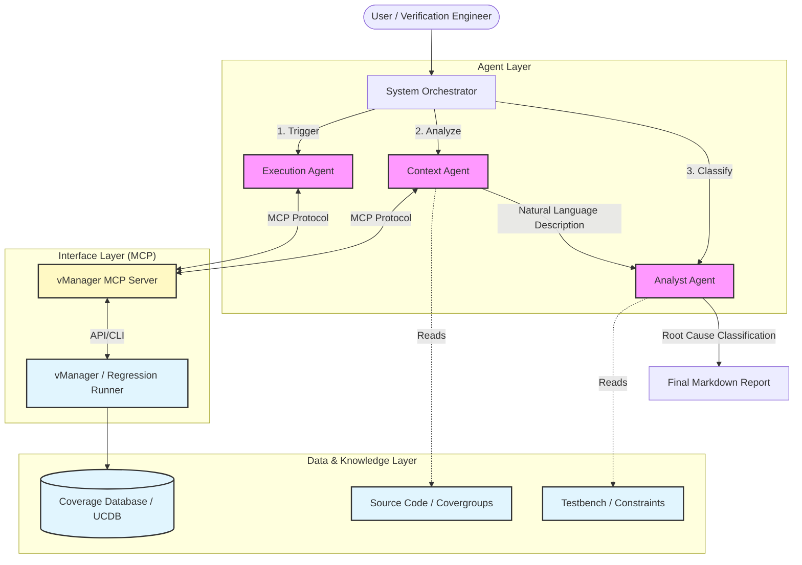

# Automated Functional Coverage Gap Analysis Using Multi-Agent Systems
## Abstract

This project proposes an architecture for automating the analysis of functional coverage gaps in Digital Functional Verification. By leveraging Large Language Model (LLM) agents connected via the Model Context Protocol (MCP) to verification management tools (vManager), the system autonomously interacts with verification tools, interprets coverage results, and classifies the root causes of coverage holes based on testbench analysis.

---

## 1. Introduction: The Domain of Digital Functional Verification
The production of a modern semiconductor chip is a complex process often visualized through the "V-Model" or the standard ASIC design flow. It begins with architectural requirements and moves down to the Register Transfer Level (RTL) implementation, usually written in Verilog.

Before the design can be synthesized into a physical layout (GDSII) and manufactured, it must undergo rigorous **Functional Verification**. The goal of verification is to ensure the RTL implementation exactly matches the architectural specifications.

### 1.1 The UVM & SystemVerilog Methodology
The industry standard for this process is **SystemVerilog** combined with the **Universal Verification Methodology (UVM)**. UVM provides a base class library that promotes the creation of modular, reusable, and scalable testbenches.

A typical UVM environment consists of:

* **The DUT (Design Under Test):** The actual RTL code being verified.
* **The Environment:** A container for all verification components.
* **Agents (UVM Agents):** Comprising Drivers (which push stimuli to the DUT), Monitors (which observe signal activity), and Sequencers.
* **The Reference Model (Golden Model):** A high-level behavioral model (often in SystemVerilog or C++) that predicts the expected output for a given input.
* **The Scoreboard:** Compares the actual output from the DUT against the predicted output from the Reference Model.
* **Functional Coverage:** A metric defined by "Covergroups" and "Coverpoints" that tracks which features and scenarios have been exercised by the tests.

### 1.2 The Verification CycleThe workflow of a verification engineer typically follows these steps:

1. **Verification Planning:** Deriving features to verify from the requirements.
2. **Implementation:** Coding the UVM testbench, checkers, and coverage models.
3. **Regression:** Running a massive suite of random tests.
4. **Debug & Analysis:** Investigating failures and analyzing coverage reports.

It is in step 4 where the bottleneck occurs. A regression might yield 80% functional coverage. The remaining 20%—the **Coverage Gap**—requires manual, time-consuming investigation to understand *why* specific scenarios were not hit.

---

## 2. Problem Statement: The Coverage Analysis Bottleneck
In a randomized simulation environment (Constrained Random Verification), reaching 100% coverage is non-deterministic. When a specific "bin" in a covergroup is empty, the verification engineer must manually analyze the gap.

This analysis involves a complex mental mapping:

1. Look at the uncovered bin (e.g., `state_transition: IDLE -> BUSY`).
2. Read the code to understand the semantic meaning of the bin.
3. Check the test constraints to see if the scenario is even generated.
4. Determine the root cause.

The proposed system aims to automate this cognitive process.

---

## 3. Proposed Solution: Multi-Agent Coverage Analysis
We propose a system utilizing a multi-agent architecture to identify, translate, and classify coverage gaps. The system uses the **Model Context Protocol (MCP)** to interface agents directly with the Verification Management tool (e.g., vManager).

### 3.1 The "Fixed Scenario" Classification Strategy
To make the analysis actionable, the system classifies every coverage gap into a list of fixed gap scenarios (that will be define din the future), these are some examples:

1. **Missing Stimulus (Constraint Issue):** The random constraints in the testbench are too tight, preventing the specific combination of inputs required to hit the bin.
2. **Unimplemented Test Sequence:** The scenario requires a specific directed sequence that has not been written yet.
3. **Unreachable (Dead Code):** The scenario is mathematically impossible in the current RTL configuration (requires an exclusion).

### 3.2 System ArchitectureThe system consists of three specialized agents:

1. **The Execution Agent:** Interfaces with vManager via MCP to trigger regressions and monitor status.
2. **The Context Agent (Semantic Interpreter):** Extracts the "uncovered bins" from the regression results. It reads the source code (SystemVerilog) and it's description written by the verification enginner, associated with the covergroup to translate the technical bin name into a natural language description of the missing functional scenario.
3. **The Analyst Agent (Root Cause Classifier):** Analyzes the existing testbench constraints and sequences to determine *why* the gap exists, mapping it to one of the "Fixed Scenarios."

#### High-Level Architecture Diagram

---

## 4. Conclusion
By automating the semantic analysis of functional coverage gaps, this system reduces the turnaround time for verification closure. It moves the verification engineer's focus from "What is this gap?" to "How do I fix this gap?", significantly streamlining the chip production workflow.

---

## 5. Resources

### From Concept to Practice: An Automated LLM-aided UVM Machine for RTL Verification
**Junhao Ye, Yuchen Hu, Ke Xu, et al. (2025)**
[paper](https://arxiv.org/pdf/2504.19959)

### PRO-V-R1: Reasoning Enhanced Programming Agent for RTL Verification
**Yujie Zhao, Zhijing Wu, Boqin Yuan, et al. (2025)**
[paper](https://www.arxiv.org/pdf/2506.12200)

### LLM-driven Verification Assistance: Bridging Code, Coverage and Collaboration
**Aparna Mohan (2025)**
[paper](https://journalijsra.com/sites/default/files/fulltext_pdf/IJSRA-2025-2287.pdf)

### UVLLM: An Automated Universal RTL Verification Framework using LLMs
**Yuchen Hu, Junhao Ye, Ke Xu, et al. (2024)**
[paper](https://arxiv.org/pdf/2411.16238)

### VerilogEval: Evaluating Large Language Models for Verilog Code Generation
**Mingjie Liu, Nathaniel Pinckney, Brucek Khailany, Haoxing Ren (2023)**
[paper](https://arxiv.org/abs/2309.07544)

### riscvISACOV: SystemVerilog Functional Coverage for RISC-V ISA
**RISC-V Verification**
[source](https://github.com/riscv-verification/riscvISACOV)
